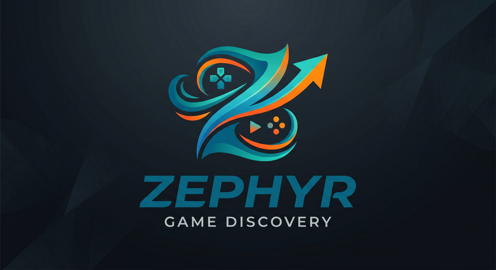

<p align="center">
  
</p>

<p align="center">
  A desktop game discovery and exploration client built with Electron.<br>
  Browse public game release databases, view cover artwork and metadata powered by Steam and Google Gemini,<br>
  watch trailers, and manage downloads with built-in safety scanning.
</p>

## What Zephyr Is (and Isn't)

Zephyr is a free, open-source desktop tool with **two independent functions**:

1. **A release-information and discovery tool.** It aggregates publicly available metadata (release names, cover artwork, descriptions, trailers, screenshots) about video game releases from sources like `predb.net`, the Steam public storefront, YouTube, and Google Gemini. Metadata is information *about* a release, not the release itself — Zephyr does not host, mirror, or redistribute any copyrighted work.
2. **A general-purpose BitTorrent client.** Built on WebTorrent, it's a neutral transport for the BitTorrent protocol — like qBittorrent, Transmission, or Deluge. BitTorrent has a long history of substantial non-infringing use (Linux ISOs, game patches, Internet Archive media, academic datasets, independent artists, and so on). The client will process any magnet link or `.torrent` the user supplies, just as a web browser will load any URL.

Zephyr is developed as a personal open-source project. It is distributed free of charge under the MIT licence, has no paid tier, no advertising, no telemetry, and no affiliate or referral arrangements with any third-party service it interacts with. The authors derive no financial benefit, direct or indirect, from what any user chooses to do with the tool.

**You are solely responsible** for ensuring your use of Zephyr complies with all applicable laws in your jurisdiction and with the terms of service of every third-party service it connects to (Steam, Google/Gemini, YouTube, Real-Debrid, VirusTotal, and any BitTorrent tracker or index). The authors do not condone, encourage, induce, or facilitate copyright infringement or any other unlawful activity, and prohibit such use.

**By using Zephyr, you agree to the terms in [LEGAL.md](LEGAL.md).** Read it before use.

## Features

- **Release browser** — Paginated, searchable grid of game releases sourced from public release databases
- **Artwork lookup** — Automatic cover art via Steam CDN, with Gemini AI fallback for broader coverage
- **Game detail pages** — Descriptions, genres, screenshots, and trailers sourced from Steam
- **BitTorrent client** — Built-in download support via WebTorrent, with optional Real-Debrid integration
- **Safety scanning** — Automatic Windows Defender scans on completed downloads, plus optional VirusTotal hash verification
- **Download manager** — Pause, resume, and remove downloads with a slide-out drawer showing live progress
- **Plugin system** — Extend Zephyr with third-party plugins installed to `userData/plugins/`. See [PLUGINS.md](PLUGINS.md) for the developer guide.

## Prerequisites

- [Node.js](https://nodejs.org/) v18 or later
- npm (included with Node.js)
- Windows 10/11 (primary platform — Windows Defender integration is Windows-only)

## Getting Started

```bash
# Clone and install
git clone https://github.com/zephyr-tools/zephyr-core.git
cd zephyr
npm install

# Start in development mode (HMR for renderer, live restart for main)
npm run dev

# Type-check the entire project
npm run typecheck
```

On first launch, open **Settings** (gear icon) to optionally configure API keys for enhanced features.

## Configuration

Zephyr uses optional API keys to unlock additional capabilities. Configure them in the in-app Settings dialog, or set environment variables:

| Setting | Purpose | Env Variable |
|---|---|---|
| Gemini API Key | Cover artwork, game details, trailers, group prerequisites | `GEMINI_API_KEY` |
| YouTube API Key | YouTube Data API v3 for trailer search | `YOUTUBE_API_KEY` |
| Real-Debrid API Key | Premium download acceleration | — |
| VirusTotal API Key | Post-download hash verification | — |

The app is fully functional without any API keys — they unlock additional features. All keys are persisted locally to `userData/settings.json` and are only sent to their respective APIs.

## Architecture

```
┌────────────┐   IPC    ┌───────────────┐    HTTPS    ┌──────────────┐
│  Renderer  │◄────────►│  Main process │────────────►│  predb.net   │
│  (React)   │          │               │             │  Steam       │
└────────────┘          │ PredbClient   │             │  Gemini      │
       ▲                │ ArtworkSvc    │             │  Real-Debrid │
       │                │ TorrentClient │             │  VirusTotal  │
       │                │ VirusScan     │             └──────────────┘
       │                └───────┬───────┘
       │                        │
       │                        ▼
       │                ┌──────────────────┐
       │                │ on-disk storage  │
       │                │ userData/cache/* │
       │                │ downloads.json  │
       │                │ settings.json   │
       │                └──────────────────┘
```

Strict context isolation (`contextBridge`, no `nodeIntegration`) ensures the renderer process has no direct access to Node.js APIs.

## Project Structure

```
src/
├── shared/              # Zero-dep types shared across all processes
├── main/                # Electron main process (Node.js)
│   ├── index.ts         # App lifecycle, IPC registration
│   ├── predb.ts         # Release database API adapters
│   ├── gemini.ts        # Artwork lookup + on-disk cache
│   ├── details.ts       # Game details + trailer lookup (Steam / Gemini)
│   ├── torrent-search.ts  # BitTorrent index search
│   ├── torrent-client.ts  # WebTorrent download manager
│   ├── real-debrid.ts   # Real-Debrid download integration
│   ├── virus-scan.ts    # Windows Defender + VirusTotal scanning
│   ├── tracker-list.ts  # Dynamic BitTorrent tracker list
│   ├── cache.ts         # Artwork blob cache utilities
│   └── settings.ts      # Persisted settings store
├── preload/             # contextBridge → window.api
│   └── index.ts
└── renderer/            # React 19 + Tailwind v4
    ├── App.tsx
    ├── components/      # ReleaseGrid, DetailPage, DownloadsDrawer, etc.
    ├── hooks/           # useDownloads, useDebouncedValue
    └── lib/             # cn, format, Zustand store
```

## Tech Stack

- **Electron 41** + **electron-vite 6** — Desktop shell with HMR
- **React 19** + **TypeScript 5.6** — Strict mode with `noUncheckedIndexedAccess`
- **Tailwind CSS v4** — CSS-first config, dark theme
- **TanStack Query 5** — Data fetching, caching, and request deduplication
- **Zustand 5** — Lightweight state management
- **WebTorrent v2** — BitTorrent client
- **Google Gemini** (`@google/genai`) — AI-powered metadata enrichment
- **BiomeJS** — Linting and formatting
- **lucide-react** — Icons

## Scripts

| Script | Description |
|---|---|
| `npm run dev` | Vite dev server + Electron with HMR |
| `npm run build` | Bundle main / preload / renderer to `out/` |
| `npm run start` | Run the built app from `out/` |
| `npm run typecheck` | Strict `tsc --noEmit` on both Node and Web configs |
| `npm run lint` | BiomeJS linting |
| `npm run format` | BiomeJS auto-format |
| `npm run package` | Build + package (directory output) |
| `npm run make` | Build + create distributable installer |

## Releasing

Zephyr uses GitHub Actions to build and publish releases. To cut a new release:

```bash
# Bump version (choose patch / minor / major)
npm version patch

# Push the commit and tag — CI takes it from here
git push origin main --follow-tags
```

This triggers the release workflow which:

1. Runs typecheck and lint
2. Builds the app and packages a Windows installer (NSIS)
3. Creates a GitHub Release with auto-generated notes from merged PRs
4. Attaches installer artifacts (`.exe`, `.blockmap`, `latest.yml`)

Users running Zephyr will be notified of the new version automatically and can update from **Settings > Application > Check for updates**.

## License

MIT
